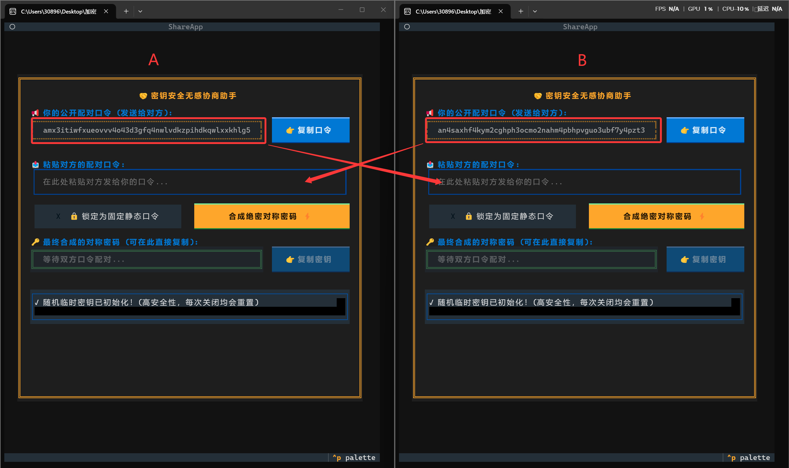
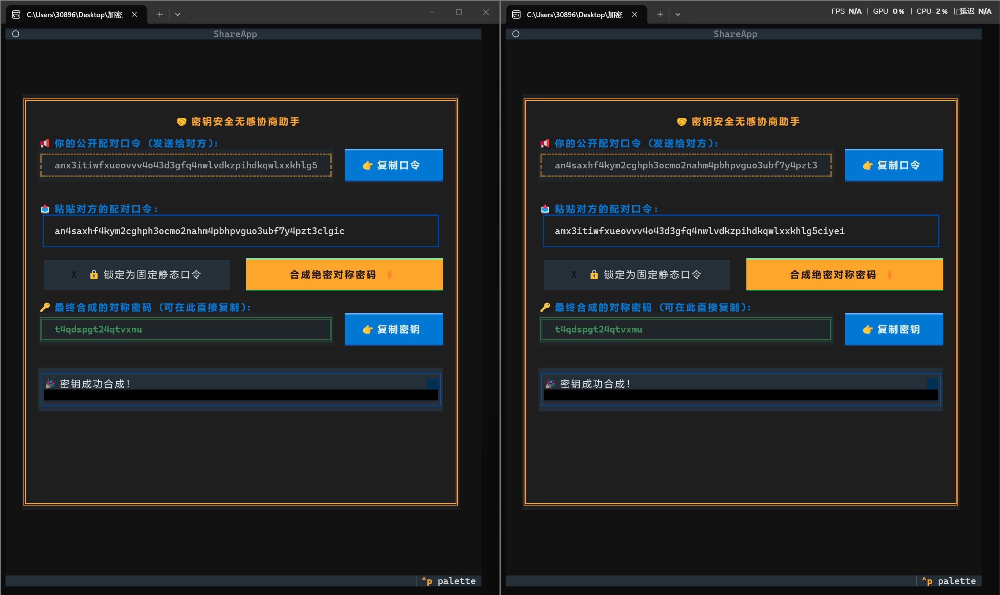
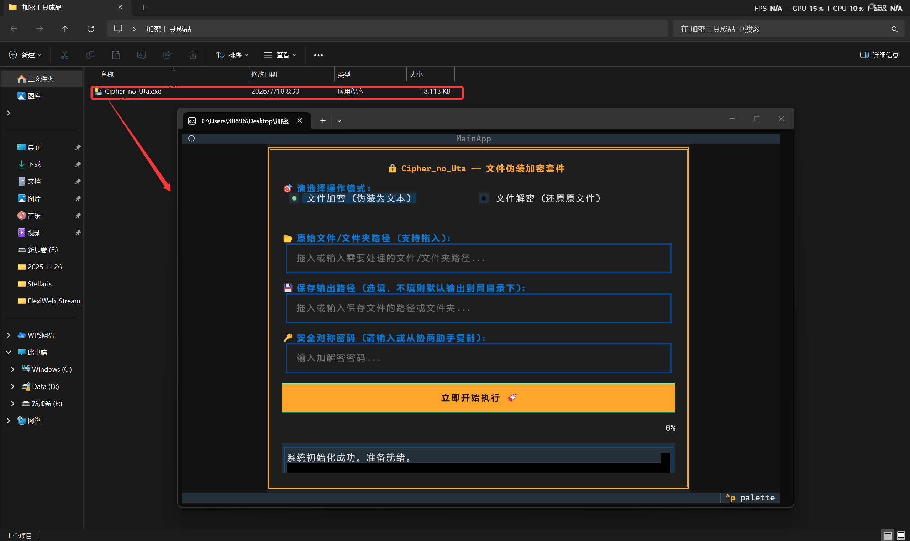
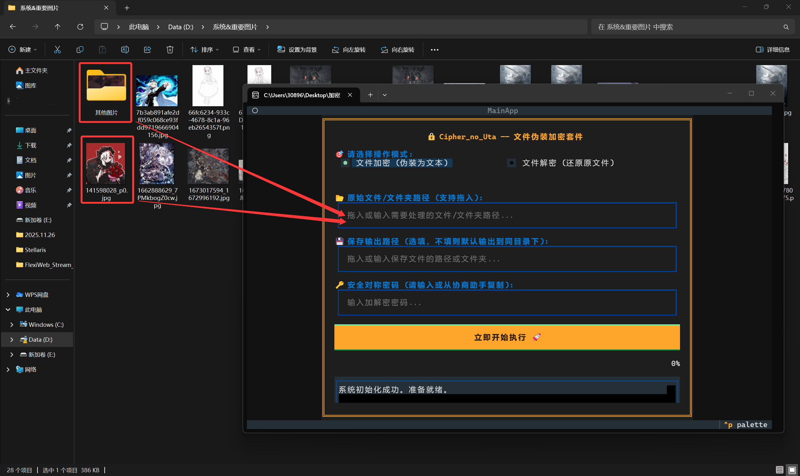
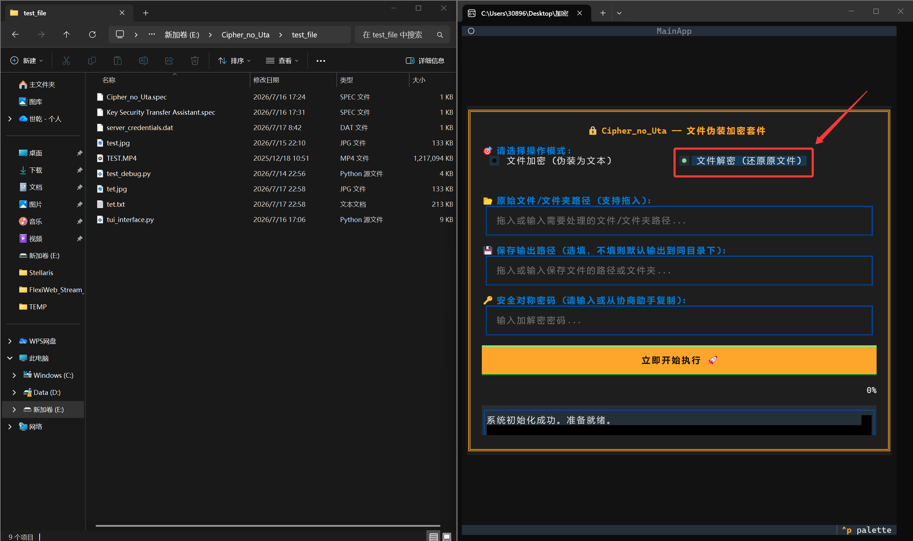
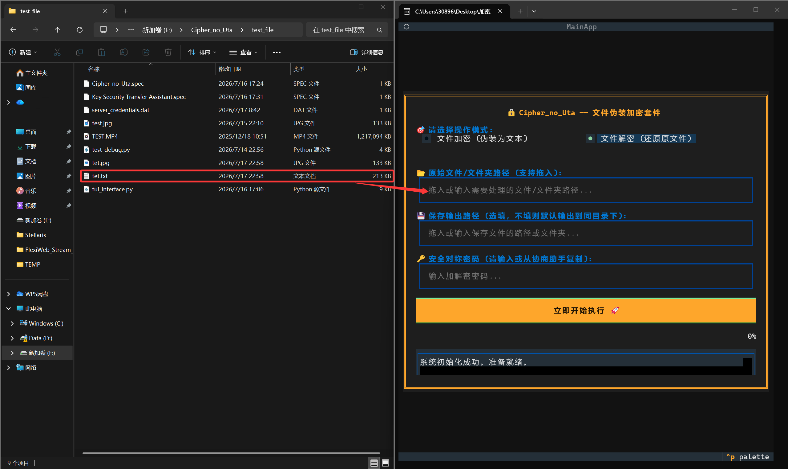

## 📖 用户使用指南（详细带图片版本）

假设你（用户A）要发送一个机密文件（或文件夹）给你的朋友（用户B），但你们之前从未约定过密码：

### 第一步：生成并交换口令

1. 双方同时双击打开**Key_Security_Transfer_Assistant.exe**。软件会在后台瞬间生成一对临时的公私钥，并在窗口上方生成你的“公开配对口令”。

2. 你们各自点击 【👉 复制口令】，并通过微信/QQ等通讯软件发送给对方。

> 注：如果不想频繁交换口令（注意：这可能会导致安全性下降），或者只有服务器端变动口令，你可以点击“锁定为固定静态口令”按钮来防止口令被刷新。

### 第二步：一键合成密码

将对方发来的口令粘贴到下方的“粘贴对方的配对口令”输入框并点击 【合成绝密对称密码 ⚡】。此时，双方电脑会各自计算出完全相同且绝不外泄的 16 位对称密码，显示在最下方的绿色高亮框中。点击 【👉 复制密钥】 备用。

### 第三步：加密并伪装文件

1. 打开**Cipher_no_Uta.exe**，选择“加密模式”。

2. 拖入你需要加密的文件（或文件夹），粘贴刚才复制的对称密码，点击开始。

程序将自动生成一个看似普通的.txt文本（该文本包含有源文件的所有信息，但是看起来只是一串只包含阿拉伯数字和英文字符的乱码）。此时可直接发送该.txt给对方（即便传输的.txt被任何审查者截获也绝无可能破解）。

### 第四步：解密与智能恢复

1. 用户B收到文本文件后，打开**Cipher_no_Uta.exe**，并切换到“解密模式”。

2. 拖入.txt文本，输入相同的对称密码，点击开始。加密得到的.txt文件将会恢复为原本的形态。

> 如果您想要回到之前阅读的页面，请[点击此处](../README.md)。